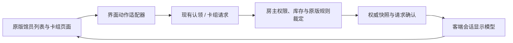

# 阶段 3.1：原版卡组界面接入方案

日期：2026-10-01。状态：需求和技术接入方案，本轮不修改代码。基于 v8 的角色认领、卡组请求、房主裁定、库存同步及保存保护继续扩展。

## 需求与已验证基线

用户报告 v8 双端可以正常锁定馆员并编辑各自馆员的卡组。这确认了基本认领和编辑流程；库存争抢、非法装备、全部底层入口、断线恢复、五人容量和双端存档哈希等专项仍按各自记录验收。

新增目标：点击馆员的“编辑卡组”后进入原版馆员卡组页面，展示房主的馆员、核心书、战斗书页和可用卡牌库；用原版卡槽、搜索、筛选和详情完成实时编辑。

建议最终流程：房主选定准备楼层 → 玩家在原版馆员列表选择馆员 → 认领或查看归属 → 点击“编辑卡组” → 原版卡组页面 → 每次加减卡由房主确认并更新双方。F9 保留房间管理和诊断功能，常规选角与选卡使用原版页面。接待选择仍属于之后的准备界面适配，不在此步骤启动合作战斗。

原版楼层选择入口由房主复用现有 `SelectFloor` 准备逻辑；客人按房主当前准备楼层展示馆员并切换查看其中角色，不自行改变房主准备楼层。原型验证先在双方已进入图书馆的环境进行，客人使用自己的存档即可，进度无须匹配房主。标题页仍可加入房间；从标题直接跳转编辑需另核实原版 UI 初始化路径，不能假定收到快照后界面就已可用。

首次完整交付包含普通原版核心书的单卡添加、移除和原版书页浏览。核心书更换、被动继承、清空卡组、卡组预设保存/应用、特殊多卡组与跨书籍占用查询先保持禁用或只读，后续分别定义命令及验收，避免原版按钮直接执行本地写入。

## 接入结构

房主继续拥有真实游戏模型；客端增加仅供本次房间显示的馆员、Book/Deck 和库存条目。原版 UI 绑定这些会话对象，所有修改命令仍交给房主。房主在此联机编辑页的动作也走同一请求/裁定路径，确保每次成功编辑立即广播，而不是依赖后台两秒采集。

会话对象按房间、准备上下文、楼层和角色槽位登记。房主的 `BookInstanceId` 用于识别房主核心书实例，不能用来查询客人的书库。模型构造和更新不能注册到客端真实楼层、书库、库存或保存列表。原版静态 XML 提供原版卡牌名称、图标、费用、骰子与核心书规则数据。

## 原版页面的实际接入点

本轮通过本机已核验的 `Assembly-CSharp.dll` 反射及 IL 检查确认了以下路径；页面启动顺序、动画和焦点仍需在 Unity 内验证。

| 用途 | 已核实入口 | 适配方式 |
| --- | --- | --- |
| 打开编辑页 | `UIController.SetCurrentSephirah`、`SetSelectedUnit`、`CallUIPhase(UIPhase.Librarian_CardList)` | 暂存原本 UI 选择，绑定本次联机角色后进入原版页面 |
| 编辑面板的当前馆员 | `CurrentUnit` getter 读取 `_uiData.unit`；`UILibrarianEquipDeckPanel.SetData()` 使用它 | 通过已核实的选择路径设置会话馆员；页面初始化与刷新均使用同一绑定 |
| 当前卡组 | `UIEquipDeckCardList.SetData(UnitDataModel)` | 客端传入会话馆员与其独立核心书/卡组 |
| 原版库存、搜索及筛选 | `UIInvenCardListScroll.SetData(List<DiceCardItemModel>, UnitDataModel)` | 注入房主库存显示条目和会话馆员，保留原版过滤与详情功能 |
| 左侧馆员列表 | `UILibrarianCharacterListPanel.SetLibrarianCharacterListPanel_Default` 默认读取本地楼层 | 联机上下文中提供房主所选楼层的馆员列表和认领归属 |
| 加卡、减卡 | `UIEquipDeckCardList.InsertCardSlot`、`RemoveCardSlot` | 提取卡 ID，发送卡组请求，跳过原版同步修改及“已成功”动画；确认后刷新 |
| 楼层唯一卡的可装备提示 | `UIInvenCardSlot.SetSlotState` 默认查询本机楼层装备 | 使用房主楼层卡组快照计算提示；最终装备规则仍由房主裁定 |

导航注意：真实 `CurrentUnit` 没有 setter，不存在 `SetCurrentUnit`；应使用 `SetSelectedUnit`。`SetCurrentSephirah` 虽确实更新楼层和通知面板，实际方法最终返回 `false`，不能仅按返回值判定导航失败。客人未开放房主楼层时还需局部适配楼层/解锁检查，让显示依据房主快照。

`UICardPanel` 的原版打开和刷新流程会重新读取 `InventoryModel.Instance.GetCardList()`，所以注入要覆盖本页的各次刷新，不只是第一次打开。可以直接给库存组件提供显示列表，无需替换全局库存单例或覆盖客端整份图书馆。

## 实时编辑与界面状态

1. 打开页时锁定编辑绑定：房间、关卡、楼层、槽位、房主核心书实例和所显示快照版本。
2. 原版卡槽动作转为现有 Add/Remove 请求；请求必须携带本次显示状态对应的修订号。不能将旧页面的槽位索引与最新快照的楼层/版本自动组合，否则换楼层后可能误操作同索引的新角色。
3. 一次保留一个在途修改，显示“等待房主确认”；搜索、滚动和详情仍可使用，修改按钮及快捷入口暂时禁用。
4. 房主复用 `DeckAuthority`、原版装备校验和 `DeckGuard.EditWithRollback`。成功后立即发送新卡组/共享库存快照与回复；拒绝则保持权威状态并给出原因。
5. 客端取得对应版本快照及回复后更新会话模型、卡组和库存组件，再解锁修改。原版页不需要重新打开；保留当前搜索、滚动和角色选择。
6. 其他玩家消耗共享库存时，即使本页没有编辑也更新库存；版本失效时刷新后再操作。旧快照和迟到回调不能覆盖新显示状态。

当前 v8 的快照回调先于清除 pending，而请求完成不会再次发快照通知。原版页适配需要独立的“请求状态变化”通知，涵盖提交、完成、拒绝、超时和断线；也可以由适配器检查 pending 状态。只依赖快照回调会让按钮在确认后仍保持禁用。

角色绑定不变时可以接收新库存、卡组和认领修订号；失去归属、换关/楼层/名单或更换核心书实例时，先撤销旧编辑绑定和卡槽事件，再关闭或重新绑定页面。关闭页时尚在途的请求仍属于房间会话，由会话继续完成；它的迟到回复不能重新打开已经关闭的页面。

## 数据补充与角色显示

| 展示内容 | v8 是否足够 | 建议处理 |
| --- | --- | --- |
| 馆员名称、楼层、核心书、卡组、容量、卡牌库存 | 足够 | 馆员名称取房主快照；核心书/卡牌名称及静态内容由原版 XML 解析 |
| 实际生效被动 | 不足 | 增加只读的有效被动 ID 列表；暂不提供被动编辑 |
| 馆员最大 HP、混乱等属性 | 不足 | 增加房主计算后的显示数值；后续若展示礼物详情再补礼物 ID/显示状态 |
| 原版角色身份、头像、立绘和外观 | 不足 | 补默认身份、原版皮肤/部件/颜色等明确字段；用本机原版资源生成显示 |
| 本机渲染槽 `textureIndex` | 不能直接复制 | 本机分配会话渲染槽并在退出时释放或恢复 |

核心书 ID 只能恢复原生静态信息，不能据此显示房主继承被动和礼物带来的实际属性。只读接入原型可以暂时隐藏未同步信息，正式交付应准确显示上述需要的角色信息，不能借用客人角色来填补。

角色显示字段使用有上限的明确 DTO；不发送整份 `SaveData`、任意 .NET 对象或头像贴图二进制。已核实当前游戏核心书等级相关 getter 为常量，不按旧存档字段额外设计不存在的升级同步。

若加入角色显示 DTO，预计房间协议升为 v9、快照格式升为 v4。现有卡组请求/回复字节结构可继续复用，但调用入口需要接受页面的期望绑定及版本。仅做已有字段的内部只读页面验证时可以暂用 v8；本轮没有修改实际协议版本或安装包。

## 权限和本地状态隔离

现有 `DeckGuard` 对客端原版改卡入口全部拒绝。新的适配应先识别联机编辑上下文，把 UI 操作转换成请求；真实客端馆员继续受原有保护。镜像构造和显示刷新仅允许操作已登记的会话对象，不能直接放开客端改卡权限，也不能拿房主的 `RunAuthorized` 或整份存档加载作为客端构造途径。

`BookModel(BookXmlInfo)` 可以创建独立书籍/卡组并读取静态 XML。馆员常规初始化会执行装备和默认卡组逻辑，需要专用的显示模型工厂并核对副作用，不假设调用普通构造函数就能完成安全镜像。

原版页面还存在保存之外的副作用：

- 打开卡组页和更新馆员列表会写教程标记；联机上下文应抑制这些教程分支或精确恢复相应字段，防止离房后的正常保存带入改动。
- 原版卡组预设会修改可被保存的 `UI.DeckListModel`；首版关闭保存/应用预设入口。
- 跨书籍装备查询依赖客端 `BookInventoryModel`；首版隐藏或禁用此查询，之后使用房主提供的数据专门适配。
- 角色渲染会复用本机渲染槽；需保存并恢复原本 UI 角色和渲染绑定。

返回页面、离房、房主断线、场景切换和认领失效都走统一清理：撤销输入、取消 UI 订阅、恢复原本楼层/馆员/页面绑定，恢复临时 UI 标记并释放会话渲染资源。正常返回时可保留房间级会话模型以供再次进入；离房时销毁全部会话对象。保存保护持续到会话清理完成，游戏进度和库存的本地原模型始终独立。

## 实施顺序与验收

1. **只读接入原型**：点击已认领馆员的编辑入口，进入原版页面；正确绑定房主角色、卡组和库存，退出恢复本地 UI。先确认数据和副作用隔离。
2. **原版增删卡**：接通卡槽操作、确认等待/拒绝提示、立即刷新、共享库存更新，以及绑定失效和断线清理。
3. **完整选择体验**：原版馆员列表显示归属和认领/编辑/查看入口，准确显示补充的角色信息。完成后常规卡组操作不依赖 F9。

三步属于阶段 3.1，位于合作战斗可行性原型之前。核心书、被动和预设的可编辑同步另立后续节点；原版邀请选择和开战流程继续按总体设计推进。

验收至少覆盖：客端未解锁房主楼层/书页也能正确显示；原版搜索筛选详情可用；他人角色只读；双端加减卡与库存一致；重复点击、快照先到/确认先到、拒绝和超时反馈正确；换楼层或名单后旧事件不能编辑新角色；离房后本地馆员、库存、教程与预设状态恢复，正常保存后本地存档仍未包含房主数据。

本轮只更新需求、设计和测试反馈记录，未修改 Mod 源码、测试程序、协议、DLL、安装或存档。
