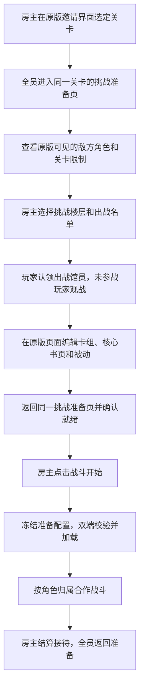

# 核心书页、接待准备与合作战斗实施方案

制定日期：2026-10-08，接续更新：2026-10-09。本文是用户已确认的后续开发计划。用户已确认 v11 普通换书和 v13 被动替换的双端基本流程正常，现从 `805396c`、房间协议13/快照7继续3.3原版接待准备。此前的争抢、异常回滚及双端存档隔离专项仍需独立结果；基本功能确认不等于全部专项验收。被动容量修复见 [修复记录](阶段3.2B被动书库容量修复.md)。

## 1. 当前基线与本次目标

用户已经确认：测试端可以选择房主的馆员，进入该馆员的原版卡组编辑页面并修改卡组，其他角色无法改动。阶段 3.1 的基本选角、原版页面绑定、对应编辑与只读权限目标已达成，不再把它列为阻塞后续开发的待办。

制定时的代码基线为 v9 的 `933c2a6`。当前接续基线为 v13 的 `805396c`，房间协议 v13、进度快照格式 v7，普通核心书和被动替换已获用户双端确认；开发分支 `codex/reception-preparation` 从该节点继续3.3。可以复用的基础包括：Steam 房间和 Relay、身份验证、房主裁定、角色认领、版本校验、卡组/共享战斗书页库存、实例级核心书库与装备事务、原版编辑页面及独立显示模型、客端保存保护。被动修改协议与原版被动弹窗已实现，原版接待准备同步及合作战斗按后续节点实施。

本次依据现有源代码及已核验 SHA-256 的本机 `Assembly-CSharp.dll` 反射/IL 调研制定方案。下文注明的真实调用行为是静态检查结果，不等于已在 Unity 内运行新增页面、事务或战斗路径；游戏内验收按各节点另行完成。

新增工作按以下顺序交付，每个节点独立打测试包并进行双端验收：

| 顺序 | 交付节点 | 玩家能看到的结果 | 完成门槛 |
| --- | --- | --- | --- |
| 1 | 3.2A：普通核心书页更换 | 在原版页面选择房主书库中的可用核心书，替换自己认领馆员的装备 | 双端属性、外观、卡组及资源占用一致；其他角色不可改；争抢和失败不会留下半次更换 |
| 2 | 3.2B：被动编辑 | 查看房主可用被动来源，添加、移除并应用一组被动继承方案 | 原版规则有效；来源书和库存一致；取消、拒绝、回滚及跨玩家占用正确 |
| 3 | 3.3：原版挑战准备 | 房主选关后所有人看到同一关卡和敌方预览，在原版准备页选楼层、出战馆员、认领与编辑 | 客端无需同等进度；编辑返回同一次准备；变更撤销旧就绪；准备操作没有客端永久进度副作用 |
| 4 | 4A：双端战斗初始化 | 房主点击开始，控制者确认同一份出战配置并进入同一次接待 | 加载前已冻结；双方敌我实例映射和首幕状态一致；客端不扣书、不推进任务、不自行结算 |
| 5 | 4B/4C：两人单幕合作 | 两人分别操作自己的馆员，房主开始本幕并同步权威结果及表现 | 输入权限、费用、目标、骰子、伤害、状态和幕末摘要一致；故意失同步能检测并停下 |
| 6 | 5：完整接待 | 多幕、波次、情绪/异常书页/E.G.O、胜负、奖励，逐步扩展到五人和特殊关卡 | 代表性普通接待通关，只有房主结算与保存；掉线/重连和已支持特殊机制分别验收 |

## 2. 最终操作流程

原版界面承担日常操作；F9 继续用于建房、加入、成员管理和诊断。客户端能独立浏览敌人、选择查看角色和阅读书页，不因另一位玩家切换详情而强制跳走。房主的关卡、挑战楼层、出战名单属于共享状态，统一广播；馆员归属由各玩家认领请求确定。每人可以认领多个馆员，房间人数与可上阵人数分别计算。

未认领的出战馆员在开战前明确显示由房主操作。房主对客人已认领馆员也不能通过普通入口编辑或操作。断线角色不会静默变成房主角色，后续由房主明确接管；观战者不参与操作就绪计数。

## 3. 阶段 3.2A：核心书页更换

### 数据与资源

现有快照只有所选楼层馆员当前装备书，不能代表房主完整的可装备核心书库。新增实例级核心书显示数据：原版 XML ID、房主书实例 ID、当前装备者、继承占用关系、可用/不可用原因，以及展示所需的属性、被动和卡组信息。两份相同 XML 核心书必须作为不同实例识别；禁止用房主实例 ID 查询客人的真实书库。

共享占用应从房主完整书库采集，包含其他楼层的装备者和被动来源，不能只检查当前准备的最多五位馆员。普通库存、默认书和特殊书分别标识，不因出现在 `GetBookListAll` 就统一视为可装备库存。第一版只允许选择未装备、未被继承占用且通过原版规则的普通核心书；占用项显示原因。已被其他角色使用的书不能因为换书请求而自动卸下，也不能经由被动来源间接修改他人角色。

### 修改事务

1. 原版换书按钮转换为请求，带房间/准备上下文、稳定馆员身份、旧书和目标书实例、当前认领与装备/资源修订号、请求 ID。
2. 房主重新采集真实模型，检查请求身份、角色归属、阶段、旧版本、目标书占用及原版限制。原版 UI 的 `canNotEquip`、继承占用、owner 和特殊接待限制并未全部封装在 `EquipBook` 内，要一并检查。书库和卡牌库共享，核心书更换与加减卡、被动提交在主线程串行裁定。
3. 使用经过核实的原版装备路径执行；明确两个布尔参数的含义。不能自行规定换书时“总是保留”或“总是清空”卡组，按原版规则处理，并显示确认后的实际卡组、可用库存、属性和外观。
4. 成功判定使用后置条件：馆员实际书引用、书的 owner、卡组合法性及资源占用。当前游戏 `EquipBook/EquipBookForUI` 即使完成赋值和重装卡组仍返回 `false`，不能将此返回值直接当作失败。
5. 快照构造通过后提交一次版本变更并广播。已提交但回复丢失时，重试返回原请求的结果，不再执行换书；发送失败不倒退已提交的权威状态。

现有 `DeckGuard.EditWithRollback` 只处理单一卡组和战斗书页库存，不能直接用于换书。新增装备事务覆盖目标馆员的核心书/外观书、旧/新书的 owner、受影响书的全部卡组、有效与继承被动、来源关系以及战斗书页库存的对象、数量与顺序。异常或提交前快照失败时恢复原引用和集合，避免通过整份存档重新加载回滚。

### 原版页面与验收

成功换书后，角色认领绑定仍是同一馆员，书实例和页面显示代次更新。现有 `NativeDeckBinding` 遇到书实例变化会关闭，需新增受控重绑：确认同一馆员和归属仍有效后重建显示绑定，撤销旧卡槽/被动事件。旧回调不能修改新书；已经返回准备或关闭的页面不能被迟到回复重新打开。

原版属性、有效被动和核心书带来的外观一并刷新。纯外观书切换、固定卡组、特殊多卡组等另行适配，不因普通换书完成就统一放开。

双端验收至少包括：客人没有同名书仍可替换；同名不同实例不混淆；两人抢同一可用书仅一人成功；无法取走已装备或继承占用书；换书后卡组/库存符合原版行为；失败恢复全部受影响状态；他人馆员不变；换书期间返回、撤权、换楼层和迟到回复不会误改；客端离房后本地装备不含房主数据。

## 4. 阶段 3.2B：被动编辑

现有有效被动 ID 列表只能展示结果，无法说明被动来源和可编辑范围。新增数据包括核心书原生被动、已继承来源书实例/被动 ID、可用来源、原版不可继承限制、当前点数/数量预算和拒绝原因。限制从房主的原版规则及真实进度读取，不在协议中凭印象写死点数或槽数。

复用原版被动页面作为选择界面，但待应用的一组候选被动保存在本次页面的独立草稿中。点击“应用”才发送整组方案，取消则丢弃草稿，避免每点一次临时槽位就占用房主来源书。页面收到其他玩家的资源变化后更新可用性，草稿可能显示冲突，提交仍以房主裁定为准。

房主按角色归属、目标书实例、被动原版规则及来源书状态校验整组方案。新增继承、移除继承和恢复原生配置都要明确定义来源占用的释放/取得；同一个来源书的多个被动不能被当作互不相关的资源。初版拒绝已装备来源书和影响他人配置的跨书修改，不自动帮用户卸装或取消其他馆员的继承。

当前原版 `ApplyPassiveSuccession` 不只是设置有效被动列表：它提交 reserved/origin 继承关系，并可能把来源书的全部卡组退回真实卡牌库存。事务必须覆盖目标书、所有来源书、相关被动 origin/reserved 状态、卡组与库存。

原版正常构造与读档的 Passive 只有 origin、reserved 为 null；Book 的 reserved 是构造器默认空对象，不自动复制已提交继承列表。真正的原版草稿缓冲在继承页面打开时初始化，独立联机草稿也要显式区分“未开始编辑”和“已编辑但未应用”。不能将正常空缓冲误判为待应用修改，也不能为了显示可用性先初始化整个真实书库。

原版被动弹窗打开即遍历 `BookInventoryModel.GetBookListAll` 重置全部书的 reserved 状态，该列表还包括默认书和特殊书；应用的确认回调再次遍历提交，并解锁成就和保存。需拦截打开、取消、应用及其延迟确认回调，全部指向独立草稿；房主只提交经过校验的受影响对象。不能仅拦最后“应用”按钮，也不能让原版全书库提交顺带改动其他玩家尚未确认的配置。

成功后同步有效被动、来源占用、共享库存、实际属性及相关卡组，其他打开页面的玩家立即看到变更；任何装备修改撤销当前准备就绪。客户端显示模型仍不注册进真实书库，不调用真实库存修改。

双端验收至少包括：添加/移除和重新应用；原版点数/数量/互斥限制；同来源争抢；源书卡组退回库存；取消不提交；失败完整回滚；目标书或归属变更后拒绝旧草稿；其他角色及客端存档不被更改。

## 5. 阶段 3.3：原版挑战准备流程

### 选关与敌方预览

房主在原版邀请界面选定可接待关卡，将关卡和实际邀请条件同步到房间，进入原版挑战准备页。客人建立同一接待的会话显示上下文，展示房主当前可见的敌方信息、可挑战楼层和限制，不要求自己的存档已解锁该关卡。

敌方显示使用原版静态 XML 加房主提供的有界动态数据：关卡/波次与敌方实例身份、角色和核心书、原版允许预览的卡组/属性、参战人数及楼层限制。原版敌方预览会读取本机进度并可能随机选择核心书，因此同步房主已解析的敌方数据，不让客端重新随机。只同步原版当前可见内容，不提前揭示未展示的剧情或隐藏阶段。不能用客端本地关卡完成记录决定是否可见。

不能简单让客端执行原版 `UIController.PrepareBattle`。已核实该调用会解锁成就并触发 `StageController.InitStageByInvitation`；其初始化关联真实图书馆、创建接待/波次并执行任务开始逻辑。房主的真实接待上下文与客端显示上下文需分开，进入页面、返回页面、首次开战中的任务/保存/成就副作用逐一核实并划分权限。

当前 DLL 的普通邀请准备/开始链只记录 `_usedBooks`，未直接扣邀请书；已查到的普通接待扣书在 `StageController.GameOver(win=false, …)` 的失败结算中调用 `DropBookInventoryModel.RemoveBook`，随后处理礼物与保存。计划按真实结算语义处理邀请消耗，不新增“开始就扣书”的联机行为。邀请用的掉落书与可装备核心书分属不同资源，也不能共用一份库存扣减逻辑。`PrepareBattle` 本身没有直接 `SavePlayData`，但相关剧情或页面切换仍可能保存，不能将整个准备过程视为没有持久化副作用。

### 楼层、出战名单与编辑返回

房主在原版挑战准备页选挑战楼层和出战名单。原版的当前接待楼层/名单成为唯一来源，再同步到认领和编辑上下文。现有 `RelaySession.SelectFloor` 只变更 `PrepClaims`，不能当作已经切换原版接待楼层；楼层和原版 `UnitBattleDataModel.IsAddedBattle` 等名单字段需要一起接入。

馆员可查看、可认领、已出战和不可出战分别显示。名单遵循本关的实际人数和特殊限制，不假设楼层有五位馆员就能全部出战。可挑战楼层取实际接待可用列表，包含已用/败退等限制，不能直接等同于存档的已开放楼层。只给当前可出战馆员分配操作权；替换名单、换关或换楼层时撤销失效认领、草稿和所有旧就绪，并提示原因。

采集名单也不能假设所有 getter 都只读：原版 `GetUnitAddedBattleDataList()` 在无人出战时会自动选择一个馆员并写 `IsAddedBattle`。快照与校验应遍历完整名单读取选择标记，不通过该方法自动补选；需要默认出战者时，由房主显式选择并同步。

点击自己认领馆员的编辑入口，可以切到卡组、核心书或被动页；编辑后返回同一关卡、楼层、名单和敌方预览，保留有效归属。正常返回不重新初始化接待，不重复触发任务、扣书或奖励。房主换关时，其他人的旧编辑页停止提交并返回新的准备上下文。

### 准备状态与开始门槛

新增独立的准备状态机和总修订号 `PreparationRevision`，状态至少包含选关、准备编辑、开始校验、加载、战斗、结算和返回准备。现有 `PreparationFrozen` 只看战斗场景是否已经 active，无法冻结点击开始到加载完成的时间窗口；准备与装备底层权限统一按新状态机判断。

出战角色的实际控制者标记就绪；观战者无需就绪。就绪绑定准确的准备修订号，任意关卡、楼层、名单、归属、卡组、核心书或被动变化都会撤销过期就绪。

只有房主可以请求战斗开始，按以下步骤执行：

1. 检查原版接待条件、名单、角色归属、当前就绪、参与者连接和所有装备资源；不允许在修改仍待确认时开始。
2. 进入 `StartPending`，冻结认领、卡组、核心书与被动，重新采集并校验最终配置；冻结与校验在主线程中完成。
3. 生成唯一 `BattleSessionId`，固定本次关卡、邀请信息、楼层、出战馆员/控制者、核心书、被动和卡组配置，向控制者发送初始化清单并等待对应版本确认。
4. 完成阶段 4A 的安全加载和首幕初始化，收到控制者加载确认及状态校验后，才允许战斗输入。观战加载状态单独显示，不计入操作就绪；首个原型可先只支持两名控制者。
5. 在开战提交前失败则取消开始并回到准备，提示失败者和原因。已进入权威战斗或执行原版结算后，不按“取消准备”简单回滚整个接待；改走已验证的战斗暂停/退出恢复路径。

阶段 3.3 可以先交付页面和准备流程。合作开始仅在阶段 4A 接入后开放，并在阶段 4 的单幕结果同步通过后作为可玩测试功能交付。房主原版开始入口也要受门槛限制，不能让它绕过联机会话直接开单机战斗。

双端验收至少包括：客人进度较低也能看同一敌方预览；房主换关/楼层/名单后全员一致；可上阵不足房间人数时正确观战；卡组/换书/被动编辑往返保留上下文；他人仅查看；变更撤销就绪；迟到修改无法穿过冻结；客端浏览和退出不改变任务/成就/库存/存档。

## 6. 阶段 4：先证明两人单幕合作

### 4A：同一次接待的双端初始化

这是战斗开发的第一个技术门槛。准备页数据一致不意味着可以直接调用原版开始方法。先选一场没有特殊脚本的原版普通接待，固定两位馆员，限制为已适配的普通单体书页和被动，验证两人使用同一份配置进入战斗，建立敌我稳定身份和客户端表现模型。原型有明确的支持列表，未适配的卡牌、被动或关卡阻止开始；该限制随验收逐项放开。

必须同步首幕所需的真实动态状态：敌我实例、楼层/波次、HP/混乱、核心书和被动、手牌/牌库/已用/弃牌/保留区域的卡牌实例、费用、速度骰、情绪、当前及后续幕待生效状态，以及必要的关卡脚本状态。准备显示 DTO 不能冒充完整战斗状态；手牌里的同名卡也不能只靠卡牌 XML ID 区分。

实际战斗对象还引用准备馆员模型，HP 等字段含浮点值，状态存在当前/下一幕/再下一幕队列，关卡有 `Dictionary<string, object>` 脚本存储。应制定显式类型和白名单适配，不能直接序列化任意对象或只同步界面四舍五入后的血量；摘要规范包含数据精度和待生效队列。未实现的脚本状态需要在该接待的支持判定中明确处理。

房主执行接待真实初始化、敌人决策和随机结果，客端从权威数据建立会话战斗视图。客端加载路径需保持对真实图书馆、邀请书、任务、成就及保存的隔离，不能通过暂时放开现有客端保护去运行完整单机开战。

先核实原版战斗模型与演出能否在阻止客端自主抽牌、敌人决策、骰子与被动结算的同时正常初始化和展示。只有完成此原型，才能确定事件适配和表现重放的具体入口。若当前架构不可行，在该门槛调整接入方式，不用同步随机种子冒充结果一致。

### 4B：本幕输入与操作权限

先支持普通战斗书页：为自己馆员的速度骰槽位选择手牌实例、目标和目标槽，撤回或改选。房主校验当前幕/输入阶段、馆员归属、卡牌实例归属、槽位、费用、目标有效性及原版限制，确认后广播输入状态。敌人意图和随机结果由房主产生。

多人各自操作自己的馆员；他人可以查看意图但不能出牌。每人控制多位馆员时按自己的所有馆员一起就绪；未认领馆员由房主操作。改牌或收到影响输入合法性的变化后撤销相关就绪。全部控制者就绪后，由房主开始本幕；共享楼层选择和后续异常书页归属由房主决定。

命令至少包含战斗会话、幕/输入阶段、请求 ID、显示状态版本、馆员/手牌/骰槽/目标身份。迟到、重复、旧战斗或旧幕输入明确拒绝。日志能关联“谁为哪个馆员提交什么，房主为何接受或拒绝”。

### 4C：房主结算与客端表现

房主运行原版权威结算，发送已确认输入、动作/拼点顺序、骰子结果、伤害与混乱、状态/被动变化、卡牌区域变化、死亡及幕末状态。客端按权威事件表现，不能另跑一遍原版结算并希望随机种子碰巧一致。

先建立有明确覆盖范围的事件表与状态字段表，逐项说明采集入口、客端如何表现、是否会触发二次结算，以及能否在幕边界重建。双方资源 ID 相同也不能保证被动和演出执行次序相同；必须验证具体适配路径。

幕边界比较约定字段的规范化状态摘要，而非比较 Unity 对象引用或整个运行内存。字段表包括已支持的敌我 HP/混乱、存活、费用、速度/目标、手牌/牌堆、状态、被动、情绪和关卡/波次等；尚未覆盖的机制不能宣称因摘要相同而已同步。

摘要不一致时禁止进入下一幕，记录事件序号和字段差异。在已验证的安全边界可重建客端状态；无法安全恢复则走明确退出路径。动作中途不强行加载快照，不重放房主扣书或奖励。表现较慢时等待必要控制者的阶段确认，网络回调仍先排队到 Unity 主线程。

阶段 4 验收：两人各操作一位馆员，分别出牌/撤牌、拼点和单方面攻击；同名手牌不混淆；越权/非法目标/费用不足被拒；首幕和幕末状态一致；双方看到同一权威动作与结果；故意漏事件、乱序或改状态后能检测并停止；客端存档保持隔离。原型验收止于单幕，完整胜负与永久奖励提交放在阶段 5；尚未适配的结算入口保持门槛控制。

## 7. 阶段 5：从单幕扩展到完整接待

按“完整普通接待 → 五人与异常恢复 → 特殊机制”扩展，不把所有原版特殊脚本一起纳入首个战斗包。

| 子节点 | 扩展内容 | 验收重点 |
| --- | --- | --- |
| 5A：完整普通接待 | 连续幕、抽弃牌与状态持续、情绪、普通异常书页/E.G.O、波次、楼层切换、胜负与返回 | 从当前原型逐项加入机制；至少选三场具体普通接待，覆盖单波、多波及情绪/E.G.O，记录支持列表与双端完整通关 |
| 5B：结算与保存 | 房主正常扣书/奖励/任务进度和原版安全点保存，客端仅显示结果并回到自己的 UI | 接待结果只提交一次；重复消息、返回和重连不重复奖励；客端不写奖励/解锁/成就，离房后正常保存仍不含房主数据 |
| 5C：五人与掉线恢复 | 最多五人、多馆员控制、观战、断线等待/显式接管、重连快照 | 控制者断线先冻结新的输入；幕已结算不重复结算；在安全边界转移控制或重建；后加入先观战；房主离开关闭会话 |
| 5D：特殊机制 | 固定/多卡组、专属书页、召唤/复活、特殊 E.G.O、特殊剧情与跨楼层接待等 | 每一类机制补状态/事件/权限后单独验收；未支持的关卡或配置在选择/开始前显示原因 |

输入阶段控制者断线时保留已确认输入，暂停接受新输入；房主选择等待或接管后进入新修订号并撤销旧就绪。幕结算或演出中掉线时，以房主已确认结果为准，到安全边界处理重连/接管；不能重新计算同一幕。

奖励以战斗会话和原版结算点识别一次提交，不能靠“收到结束包”直接给奖励。客户端中断后仍应能查看房主已提交结果；房主原存档的持久化策略沿用已确认的产品规则。自动迁移房主和第三方战斗 Mod 不在本计划范围内。

## 8. 代码组织与协议演进

以下为职责划分。3.2A 已新增 `EquipmentMirror/EquipmentProtocol`、`EquipmentAuthority/EquipmentTransaction` 和 `NativeEquipmentEditor`；3.2B 接续新增 `PassiveMirror/PassiveProtocol`、`PassiveAuthority/PassiveTransaction` 和 `NativePassiveEditor`，复用装备事务 savepoint 与共享资源版本。准备、战斗模块仍按计划接入，保持已验收卡组模块的职责。

| 模块 | 新职责与现有衔接 |
| --- | --- |
| `EquipmentSnapshot/EquipmentProtocol` | 实例级核心书库、被动来源/占用、有界 DTO 和换书/应用被动请求；原版静态 XML 保持本地读取 |
| `EquipmentAuthority/EquipmentTransaction` | 原版规则、跨书资源、提交/去重和完整局部回滚；衔接 `DeckGuard`，不扩大客端授权范围 |
| `NativeEquipmentEditor` | 原版核心书/被动页与独立草稿；复用显示模型生命周期，扩展 `NativeDeckBinding` 的受控换书重绑 |
| `PreparationSession/PreparationSnapshot` | 接待状态机、总修订号、实际楼层/名单/归属/就绪、冻结和开始清单；衔接 `PrepClaims` 与 Relay |
| `NativeReceptionBridge` | 原版邀请/挑战准备、敌方预览、角色入口和返回上下文；隔离客端任务、成就、扣书与本地 UI 状态 |
| `BattleSession/BattleProtocol` | 战斗身份、输入/幕阶段、角色权限、可靠事件、加载/阶段确认及结果提交标识 |
| `BattleStateAdapter/BattlePresentation` | 真实状态采集、输入接入、客户端表现和已验证的边界重建；与准备显示模型分别处理 |
| `Diagnostics` | 准备/战斗会话、修订号、请求、事件与摘要差异；避免采集存档全文和敏感凭据 |

增加核心书/被动等不兼容字段时提升房间协议及对应消息格式版本，两端必须使用同一测试包。装备快照不要无限追加到当前进度包；核算 64 KiB 消息上限，必要时拆成有总量上限、会话/版本/分页校验的独立消息，完整校验后原子替换显示数据。

所有修改仍在房主 Unity 主线程执行；每条命令绑定实际显示的上下文，不能把旧按钮身份与新快照修订号拼接。客户端一个装备修改未完成时，不再同时提交换书、改卡或应用被动；其它玩家可操作，但共享资源在房主串行裁定。ACK 和对应版本快照都到达后才解除等待状态。

## 9. 下一轮开发的具体起点

先做 **3.2A 普通核心书页更换**，交付范围固定为：实例级房主核心书库 → 可用/占用原因只读展示 → 房主事务及协议 → 原版换书入口 → 属性/卡组/外观刷新和旧事件撤销 → 双端验收。此步不要求先完成被动页面或战斗。

2026-10-09 接续：用户已双端确认 v11 普通换书正常，3.2B 独立被动草稿、整组应用、来源占用及局部事务已接入 v12；新增被动编辑仍需按测试说明完成游戏内双端验收。下一开发节点为 3.3 原版挑战准备，不能把目前 F9 选关计划当成真实联机接待。

同日 v12 双端反馈：房主505本核心书的完整被动池超出进度消息容量，双方入口因此不可用；v13改为有界无损压缩并补实际规模、Framework与游戏Mono检查。当前先按 [容量修复](阶段3.2B被动书库容量修复.md)完成双端复测，之后继续3.3。

已将 v9 验收与计划基线 `cc33b74` 推送到 `origin/codex/native-deck-editor`，3.2A 使用 `codex/core-page-editor`。v9 包和 v8/v7 回退包保留；新增功能逐包验收，安装仍先备份旧 Mod，不修改游戏程序集或客端存档。当前安装与下一节点状态以 [接续指南](当前状态与接续指南.md) 为准。

每步检查应针对新风险：协议/权限/资源竞争和事务故障用自动检查，真实入口签名用已核验游戏 DLL 检查，页面/双端/存档副作用用游戏内验收。已有卡组正常流程做回归，但不把自动检查替代双端反馈，也不要求重复全部基础验收才允许推进下一节点。

接续状态见 [当前状态与接续指南](当前状态与接续指南.md)，总体产品规则见 [联机 Mod 设计方案](联机Mod设计方案.md)，已完成页面证据见 [阶段 3.1 验证记录](阶段3.1原版卡组验证.md)。

## 10. 已核实的原版调用入口备忘

以下调用关系经本机真实 DLL 的反射/IL 静态核实；选择何处打补丁、执行顺序和运行效果仍属于各阶段原型的验证工作。

| 用途 | 真实入口/关系 | 接入时注意 |
| --- | --- | --- |
| 核心书更换 | `UnitDataModel.EquipBookForUI` → `EquipBook` → `ReEquipDeck` | 不以返回 bool 判断成功；检查 UI 规则和全部受影响卡组/库存 |
| 被动草稿与提交 | 被动弹窗打开初始化全书库 reserved；确认回调逐书 `ApplyPassiveSuccession` | 用独立草稿替代全局初始化/提交，接管延迟确认和取消 |
| 浏览关卡 | `UIInvitationPanel.SetCurrentStage(StageClassInfo)` | 只赋当前关卡，不能等同已经建立接待上下文 |
| 敌方预览 | `UIInvitationStageInfoPanel.SetData` → `UIEnemyCharacterListPanel.SetEnemyInfo/SetEnemyWave` | 房主解析动态敌方数据；客端不查本地进度或重新随机 |
| 确认邀请/准备 | `ConfirmSendInvitation` → 任务 `OnSendInvitation` → `UIController.PrepareBattle` → `StageController.InitStageByInvitation` | 房主真实执行；客端投影避免任务/成就/图书馆副作用 |
| 挑战楼层 | `UIBattleSettingPanel.SetNextSephirah` → `StageController.SetCurrentSephirah` 与 `UIController.SetCurrentSephirah` | 与联机认领的楼层统一，而非只写 F9 选择 |
| 出战馆员 | `SelectedToggles` → `SetYesToggleState/SetNoToggleState` → `UnitBattleDataModel.IsAddedBattle` | 人数上限来自实际 `StageWaveModel.AvailableUnitNumber`，校验和采集不自动补选 |
| 开始按钮 | `UIBattleSettingPanel.OnClickBattleStart` → `UIController.OnClickGameStart` → 背景动画 | 在动画前拦截并进入开始校验；特殊终盘 `StartLightSpread` 分支首版排除 |
| 实际战斗启动 | 动画 `OnChangeVisual` → `GlobalGameManager.LoadBattleScene` → `BattleSceneRoot.StartBattle` → 协程 → `StageController.StartBattle` | 会创建单位、地图、抽牌并触发被动/任务/波次脚本，不能用作客端简单页面跳转 |
| 卡牌输入候选 | `BattlePlayingCardSlotDetail.AddCard(BattleDiceCardModel, BattleUnitModel, int, bool)` | 仅核实签名；权限、前置校验和撤牌/改牌路径需在阶段 4 原型继续核实 |

## 11. 3.3交付接续（2026-10-09）

v13被动替换已获双端基本流程确认，现已实现并安装v14普通接待准备测试版，协议14/快照8；范围与验证见 [3.3接待准备验证](阶段3.3接待准备验证.md)。原版邀请到挑战准备、房主动态敌方与隐藏规则、真实楼层/出战名单、认领配装往返和当前版本就绪均已接入。新增页面仍待双端实机验收，特殊接待及未进入显示协议的战斗属性保持明确限制。

本节点双方原版开战入口均拦截。下一步仍按4A初始化、4B/4C两人单幕、阶段5完整接待推进，不把准备功能或就绪检查视为战斗同步已完成。
