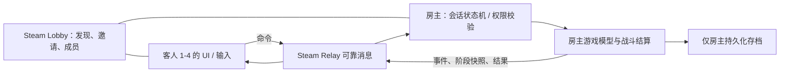

# 《废墟图书馆》合作联机 Mod 设计方案

状态：总体方案已获确认，阶段 0–3 按记录推进；2026-10-08 用户确认 v9 原版卡组页面的双端选角、对应编辑与其他角色只读基本流程正常。本次补充阶段 3.2 核心书页/被动、阶段 3.3 原版接待准备及后续合作战斗实施计划，新增功能尚未实现。调研日期：2026-09-24；范围确认：2026-09-25。详细拆分见 [后续实施方案](核心书页接待与合作战斗实施方案.md)。

## 1. 目标与默认规则

一位房主使用自己的存档创建房间，最多五人（含房主）。房主决定下一次接待；其他人看到房主的关卡解锁、馆员和可用卡牌等联机所需状态。每次接待前，玩家认领可上阵的馆员；认领者独占该馆员的卡组编辑和战斗操作。房主保存接待结果。

本设计中的“同步主机进度”指**仅在房间内临时使用房主进度**。客人的本地存档不被覆盖，也不获得房主的永久关卡解锁或奖励。一个房间的人数上限与某关的可上阵人数分开计算：可上阵不足五人时，多余玩家观战或共同讨论，由房主决定是否开战。

初版仅支持原版内容和本 Mod；其他 Mod 不在初版范围内。玩家必须在 Steam 上运行同一游戏版本、同一联机 Mod 协议版本。房主掉线时结束房间并保留最近一次已提交的房主存档；暂不自动迁移房主。接待进行中加入的玩家先观战，从下一次准备阶段开始认领角色。

## 2. 已验证的技术基础

- 本机游戏目录：`D:\game\steamapps\common\Library Of Ruina\`。它是 Unity Mono 游戏，`LibraryOfRuina_Data/Managed/Assembly-CSharp.dll` 存在，当前 SHA-256 为 `E450EF9DD29ABF5828491A891D86515D4AF35C21C81D8E076335B86F6231C901`。更新游戏后重新核对接入点。
- 官方安装自带 `LibraryOfRuina_Data/Mods/ModSample`。其 `StageModInfo.xml` 声明 Mod，`Assemblies/LOR_Sample_dll.dll` 内的示例代码以 `ModInitializer.OnInitializeMod()` 为入口；“LOR With Mods” 才会加载该目录。Project Moon 的[更新公告](https://steamcommunity.com/app/1256670/announcements/)也链接官方 Mod / DLL 手册。
- 游戏已带 `Facepunch.Steamworks.Win64.dll`，当前 SHA-256 为 `7F4E025564E9B2DD6AC248727B37C9767212C567B18A422629256737524D23B8`，程序集目标为 .NET Framework 4.6。本地反射确认有 `SteamMatchmaking.CreateLobbyAsync(int)`、`Lobby.Join()`、`Lobby.InviteFriend()`、`SteamNetworkingSockets.CreateRelaySocket<T>()`、`ConnectRelay<T>()`。**API 存在不等于运行时联通成功**，第一阶段须用两个 Steam 账号实测。
- 本地程序集可见 `LibraryModel.GetSaveData/LoadFromSaveData`、`StageController.InitStageByInvitation/StartBattle/CompleteApplyingLibrarianCardPhase`、`UnitDataModel.AddCardFromInventory/MoveCardToInventory`、`GameSave.SaveManager.SavePlayData`，以及接待、战斗准备和编辑卡组的 UI 类型。这些是候选接入点；精确调用路径和副作用须在首个原型中反编译核实，不能仅凭方法名打补丁。
- 该目录已有 .NET SDK 7 和 .NET Framework 4.6/4.7.2 引用程序集，可在独立项目编译面向 .NET Framework 的 Mod DLL，不把游戏程序集提交到 Git。

## 3. 总体架构

所有客户端加载相同 DLL，角色身份在运行时决定。大厅只承载房间发现、邀请、人数、版本摘要和成员列表；较大的进度快照及实时命令走 Steam Relay。Steam 文档确认大厅支持成员上限、元数据和邀请；联网 API 支持经 Steam 网络的 P2P 通信。[大厅文档](https://partner.steamgames.com/doc/features/multiplayer/matchmaking)、[Steam Datagram Relay 文档](https://partner.steamgames.com/doc/features/multiplayer/steamdatagramrelay)、[Facepunch 实现](https://github.com/Facepunch/Facepunch.Steamworks/blob/master/Facepunch.Steamworks/SteamMatchmaking.cs)。

房主是唯一权威：客端只发送“请求”，房主检查 Steam 身份、当前阶段、角色归属、资源合法性和版本号，再把确认结果广播。网络回调先入队，在 Unity 主线程操作游戏对象。每条消息带协议版本、房间会话 ID、消息序号、阶段号和请求 ID；限制大小与频率，拒绝过期或重复请求。进度数据使用显式字段的版本化 DTO，不传任意 .NET 对象，也不反序列化对端提供的类型名。

项目分层：`ModBootstrap`（加载与补丁）、`GameAdapter`（游戏状态/UI 接入）、`Session`（房间与状态机）、`Transport`（Steam Lobby/Relay）、`Protocol`（DTO 与校验）、`Diagnostics`（日志及哈希）。优先使用官方 Mod 加载器 + 自带的 Facepunch 库；运行时修改采用 Harmony 的前/后置补丁，尽量只在会话激活时影响原流程。Harmony 文档说明其可对 Unity Mono 方法运行时打补丁；是否需要随 Mod 打包 Harmony DLL、是否与其他 Mod 冲突，要在加载原型中验证。[Harmony 文档](https://harmony.pardeike.net/v2/articles/intro.html)。

## 4. 具体流程

### 房间与进度

1. 房主创建容量 5 的 Steam 大厅，设置公开/仅好友、Mod 协议版本、游戏构建摘要、当前状态；加入者可通过房间列表或 Steam 邀请进入。人数已满、版本不合、正在拒绝加入时显示明确原因。
2. 连接建立后房主发送只读进度快照，包括可选关卡、已开放楼层、馆员及可编辑卡牌库存、当前接待准备信息。客人只在本次会话的内存模型中展示/操作这些数据；所有磁盘保存入口对客人关闭。开始前备份房主存档，并验证退出房间后客人原存档仍可正常打开。
3. 房主选择关卡与邀请书，广播 `StageSelected(stageId, revision)`；客人只能查看。切换关卡会撤销准备状态，并按关卡可上阵人数重建角色槽位。

### 角色认领与卡组锁

每个可上阵槽位由会话内稳定的 `unitSlotId` 表示，并映射到该次接待的楼层/馆员数据。状态为 `Unclaimed`、`Claimed(steamId)` 或 `Unavailable`。认领请求用 `expectedRevision` 做乐观并发控制：房主原子决定胜者并广播新版本；同时抢同一角色时只有一个成功。玩家可认领多个角色；已认领角色只有本人能修改和操作，房主也不能通过普通 UI 直接改动。断线后角色转给房主前须显示提示，并由房主确认。

卡组编辑先通过客端自己的 UI 形成“增加/移除卡牌”等命令，房主检查角色归属、卡牌库存、卡组上限和装备限制后，在房主模型上执行并广播确认的新卡组/库存版本。客端乐观显示时若房主拒绝，立即恢复权威状态。其他玩家查看该角色是只读；UI 禁用之外，底层改卡方法也必须校验，防止快捷键或其他入口绕过。关卡准备完成后冻结卡组，直到接待结束或返回准备界面。

### 阶段 3.1：原版馆员与卡组界面（2026-10-01 新增需求）

目标流程为：在原版馆员列表选择并认领角色，点击“编辑卡组”进入原版卡组页面，使用房主的角色和卡牌库存实时编辑。F9 保留房间管理与诊断；原版搜索、筛选、卡槽和书页详情成为常规操作入口。

复用 v8 已有的房主裁定、Add/Remove 请求、库存修订号、失败回滚与保存保护。增加原版 UI 适配器及客端独立的会话显示模型，局部提供房主角色列表、卡组和库存；原版卡槽操作转成请求，收到对应快照和确认后刷新页面。房主在联机编辑页也走同一裁定路径，保证成功后立即广播。

编辑页面必须绑定确定的房间、关卡、楼层、馆员槽位及核心书实例，换楼层或失去认领后撤销旧输入。原版教程、预设和角色渲染也须隔离或清理，退出房间后恢复客端原有 UI 与本地状态。补充角色被动、属性及外观的显示 DTO 时提升协议版本，原版静态卡牌内容继续由本地 XML 提供。

首个完整交付覆盖普通核心书的选角、认领、查看和单卡增删。核心书更换、被动继承、清空/预设以及特殊多卡组随后独立接入。详细的真实 UI 入口、数据补充、异步状态和验收条件见 [原版卡组界面接入方案](原版卡组界面接入方案.md)。2026-10-08 用户已确认 v9 基本原版页面流程正常，自动检查、用户反馈及仍需专项验收的边界见 [阶段 3.1 验证记录](阶段3.1原版卡组验证.md)。

### 阶段 3.2：核心书页与被动编辑

先同步房主实例级核心书库及全楼层装备/继承占用，再在原版页面更换自己认领馆员的普通核心书；书实例变化不改变馆员归属，更新属性、外观、卡组和库存，并撤销旧页面事件。已被其他馆员装备或继承占用的书不自动卸下。

被动页面使用独立草稿，一次应用整组方案；房主检查实际点数/来源限制及共享占用，按原版规则提交。换书/被动事务覆盖受影响馆员、旧/新书、来源书、全部相关卡组与库存，不能沿用仅覆盖单卡增删的回滚。客端的真实书库和被动状态继续隔离。详细入口、副作用及验收见 [后续实施方案](核心书页接待与合作战斗实施方案.md)。

### 阶段 3.3：原版挑战准备与房主开战

最终流程：房主在原版选关 → 全员进入同一关卡挑战准备页、查看原版可见的敌方信息 → 房主选挑战楼层和出战名单 → 玩家认领并编辑卡组/核心书/被动 → 返回同一准备页并就绪 → 房主开始 → 双端校验和加载 → 合作战斗。F9 保留房间与诊断功能。

原版进入准备的调用还会关联真实图书馆、触发任务和成就，客端使用独立会话投影，不能直接运行房主原版初始化。实际挑战楼层、出战名单、认领和就绪统一受准备修订号管理；任何配置修改撤销旧就绪。开始请求先冻结并校验，建立战斗身份与初始化清单，等待控制者加载确认。

准备页面可先验收，开始入口须经过阶段 4 的双端初始化门槛；单幕结果同步通过后再交付可玩战斗。房主的原版开始按钮也须接入该门槛，避免绕过同步自行进入单机接待。

### 战斗

客人仅可为自己认领的馆员选择战斗书页、速度骰槽位和目标，以及其专属 E.G.O 等操作；未认领的馆员由房主操作。共享选择（如楼层、异常书页归属、下一幕与退出接待）由房主决定。每位参战玩家可对本幕标记“准备完成”；全部完成后房主结算，房主可取消准备重新编辑。

**战斗同步采用房主权威结算 + 客端表现重放。** 房主发送已确认输入、随机性相关结果、骰子/伤害/状态等战斗事件，以及幕边界状态摘要。客端以相同游戏数据表现动作，但不得自行决定权威结果；幕边界比较双方状态哈希。出现分歧时暂停进入下一幕，重建客端可重建的状态；无法安全恢复则回到房间准备界面并保留诊断日志。由于原版战斗内部状态和演出耦合很深，这部分必须通过原型证明，不能把“同步种子”当作完成联机。现有 PvP Mod 的作者也明确指出其种子锁步方案与其他战斗 Mod 的兼容限制；该项目是技术参照，**不是**可直接复用的合作模式。[Multiplayer Ruina Online 说明](https://steamcommunity.com/sharedfiles/filedetails/?id=3683946404)。

每幕及接待结束至少覆盖：敌我速度骰和目标、出牌/撤牌、费用与手牌、骰子结果、伤害/混乱、状态与被动效果、情绪/异常书页、E.G.O、死亡/复活、波次切换、奖励。需要在战斗原型中建立“可序列化状态字段清单”和事件适配器，逐项验收。特殊接待和第三方战斗 Mod 在适配前保持禁用。

### 存档与异常处理

房主在游戏原本允许保存的安全点持久化；接待开始/结束可另建带时间戳的备份。客人不写入自己的存档。掉线时尚未提交的本幕输入作废，已锁角色在准备阶段由房主重新分配；战斗中先暂停，房主选择等待、由自己接管或返回准备。重连时先校验版本和房间会话 ID，再发最新阶段快照；只在已验证的安全点恢复战斗。Steam 会自动转移大厅 owner，但本 Mod 的“房主存档权威”不会随之自动转移，因此原房主离开时关闭会话，避免错误写入其他人的存档。[Steam 大厅 owner 行为](https://partner.steamgames.com/doc/api/ISteamMatchmaking)。

## 5. 分阶段开发与验收门槛

| 阶段 | 交付 | 必须通过的验收 |
| --- | --- | --- |
| 0. 加载与观察 | 代码型 Mod 能在 `LOR With Mods` 启动；记录版本、加载顺序、候选调用路径 | 原版启动/关闭正常；无存档变化；游戏更新检测可阻止未知版本运行补丁 |
| 1. 房间 | 两个 Steam 账号创建/搜索/邀请/加入/离开，最终扩至 5 人 | 房主+4 客人成功；第 6 人明确被拒；掉线和版本不一致有清楚提示 |
| 2. 进度镜像 | 客人看到房主可选关卡与馆员；房主选择接待 | 客人无法改选关卡；客人退出后本地存档哈希不变 |
| 3. 认领与卡组 | 抢占、释放、编辑、只读限制、库存同步 | 同时认领只成功一人；非拥有者从 UI 与底层入口均无法改卡；失败请求可回滚 |
| 3.1 原版编辑界面 | 原版馆员列表认领/编辑入口，原版卡组页显示房主会话角色与库存，实时单卡增删 | 客人未解锁内容也可显示；界面动作仍由房主裁定；共享库存和异步按钮状态正确；退出恢复原有本地状态，存档不含房主数据 |
| 3.2 核心书页与被动 | 原版核心书实例选择、更换、被动草稿/应用/撤销，资源占用与完整装备事务 | 他人角色不可改；原版限制有效；共享来源争抢只成功一人；卡组/库存/占用一致，失败完整回滚 |
| 3.3 原版挑战准备 | 原版选关与敌方预览、挑战楼层/出战名单、认领/编辑返回、就绪与冻结 | 低进度客人正确显示；全员上下文一致；修改撤销就绪；客端任务/成就/库存隔离；开始入口受双端战斗门槛控制 |
| 4. 战斗可行性原型 | 先验证双端安全加载和首幕初始化，再实现两人同一原版普通接待的一幕，各操作一位馆员 | 双端相同出牌、骰子、血量、状态、权威动作结果，幕末约定字段摘要相同；故意扰动后可检测并安全停下 |
| 5. 完整接待 | 五人、不同波次、异常书页/E.G.O、胜负和奖励 | 三类代表性原版接待完整通关；重连/掉线测试；房主保存结果且客人本地存档不变 |
| 6. 发布准备 | 设置页、中文提示、日志开关、打包脚本、安装说明 | 干净游戏安装可复现；版本不合与已知冲突可阻止开房；Steam 创意工坊发布前人工审阅 |

**关键门槛是阶段 4。** 若原版战斗无法可靠地重放或在幕边界重建状态，需先调整战斗同步架构，再承诺完整接待；房间、进度与卡组模块可以保留。不会以“房间能连上”宣称已完成合作战斗。

## 6. Git 与发布控制

仓库仅保存源代码、协议、测试、文档和构建脚本，不提交游戏 DLL、游戏资源、存档、日志、Steam 凭据或下载的第三方二进制。引用游戏 DLL 使用可配置本机路径；构建产物写入忽略目录。`main` 保持可启动的已验证版本，新阶段默认在 `codex/*` 分支开发，历史 `feature/*` 分支保留，经对应验收再合并并打 `v0.x` 标签。协议变更增加版本号；游戏更新修改接入点时记录新程序集哈希。部署脚本只复制 Mod 文件到用户指定目录，先备份旧 Mod 目录，不覆盖原游戏程序集；每次安装可回滚。

v8 基本认领锁定和对应编辑、v9 原版页面基本流程均已获用户双端确认。以 v9 代码节点 `933c2a6` 为后续基线，先实施核心书页与被动，再接原版挑战准备和合作战斗。未收到的库存竞争、断线与存档隔离等专项结果继续列入各节点回归；当前测试包和旧回退包保留。

## 7. 已确认的产品取舍

1. 客人进度仅在房间内临时跟随房主，不永久获得关卡解锁；房主独占奖励和永久存档。
2. 初版仅支持原版 + 本 Mod，不考虑其他 Mod。
3. 房主离开即关闭房间；特殊剧情、多人跨楼层关卡可在普通接待跑通后逐步适配。

## 参考资料

- [Project Moon 的 Mod 与 DLL 更新公告](https://steamcommunity.com/app/1256670/announcements/)
- [Steam Matchmaking & Lobbies](https://partner.steamgames.com/doc/features/multiplayer/matchmaking)
- [Steam Datagram Relay](https://partner.steamgames.com/doc/features/multiplayer/steamdatagramrelay)
- [Facepunch Steamworks 大厅源码](https://github.com/Facepunch/Facepunch.Steamworks/blob/master/Facepunch.Steamworks/SteamMatchmaking.cs)
- [Harmony 2 简介](https://harmony.pardeike.net/v2/articles/intro.html)
- [LORAP 项目（现有 Harmony Mod 示例）](https://github.com/Az-LastPenguin/LORAP)
- [Multiplayer Ruina Online 创意工坊说明（PvP，对兼容性的警示）](https://steamcommunity.com/sharedfiles/filedetails/?id=3683946404)
